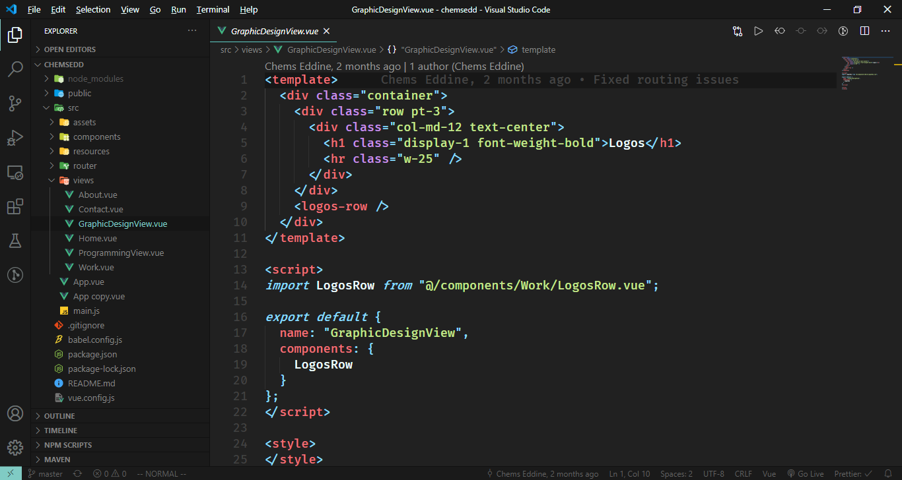

# dotfiles
Dotfiles (settings, configurations, customization, etc.)

## VS Code
My favorite code editor is VS Code with VIM keybindings. I always thought that the combination of Modern tools with the old ones, will surely bring up the best experience and the most productive environment for developers (VS Code + VIM).

